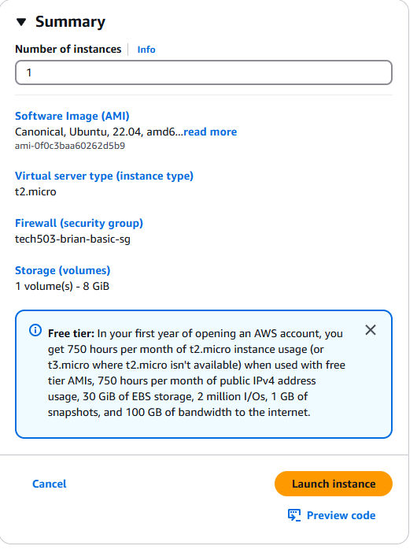
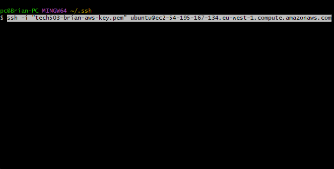
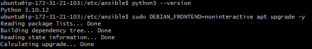
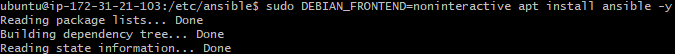
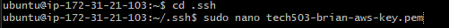
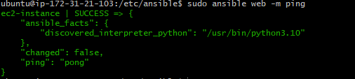
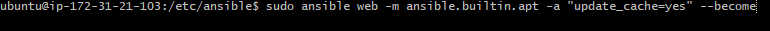

# Ansible Code Along
## Launch EC2 Instance
### Ansible Controller & Taget Node
Launch two blank EC2 instance running Ubuntu Server: 22.04 - t2.micro - sg with port 22(ssh). Title one Controller and the other Target



## SSH into Controller Node

- Connect using ssh client (gitbash)

### Check Python , Update and Upgrade


- Check that Python3 is running (needed for Ansible)
- Update packages
- Upgrade packages
  
### Install Ansible & Configure Permission


  - Install Ansible using: sudo apt install ansible -y.
  - Check Version(ansible --version)
  


- cd into ssh folder.
- create a aws private key file (must match target node key).
- use chmod400 to give super user read permission, enabling user ability to view the contents of the file (needed to ssh)
  


- cd into ansible folder
- edit hosts file
- edit new inventory called web and add target node


### Test connection


- once saved test connection using sudo ansible web -m ping

### Ansible commands



- Update and Upgrade

### Extra commands
- Copying files :
```
sudo ansible web -m ansible.builtin.copy -a "src=/home/ubuntu/.ssh/tech503-brian-aws-key.pem dest=/home/ubuntu/.ssh/tech503-brian-aws-key.pem"
```
- Install and Restart Nginx :
```
ansible all -m ansible.builtin.apt -a "name=nginx state=present" -become
ansible all -m service -a "name=nginx state=restarted" -become
```
## Config Ansible
- In etc/ansible/ansible.cfg
- Changing the interpreter (removing pink text)
- Removing need to confirm "Known Hosts" in command line
```
[defaults]
host_key_checking = False
interpreter_python = auto_silent
```